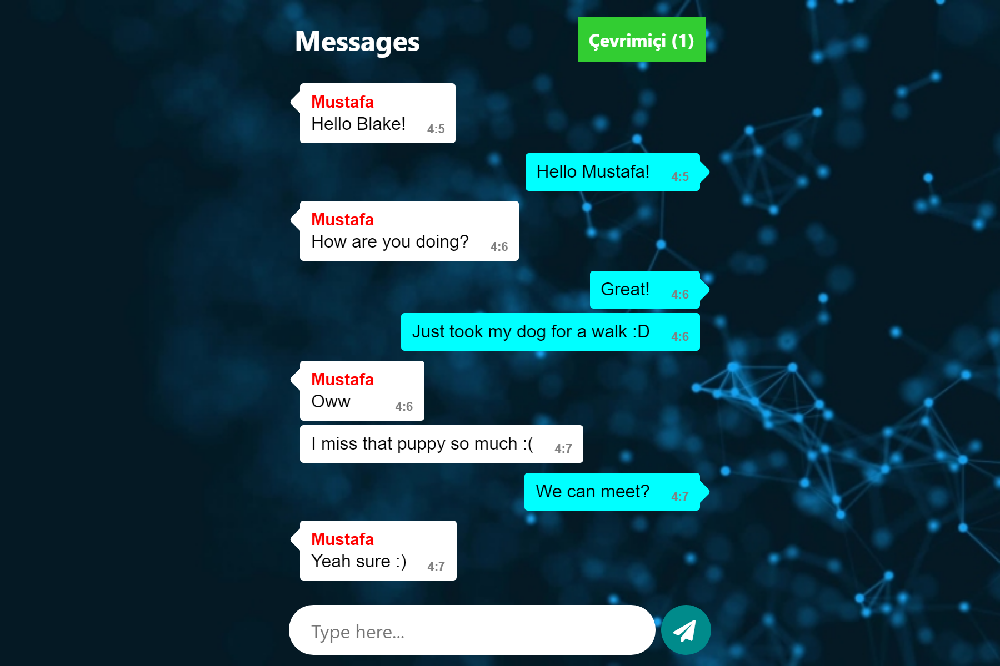

# Message App
Messaging App in NodeJS


## Install
Run these commands in the source directory

``` sh
npm i
npm start
```

Then go to link __http://localhost:8080__

Done 👌️

## Images
### Desktop


### Mobile
